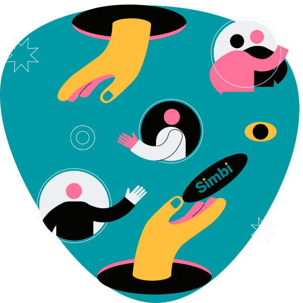
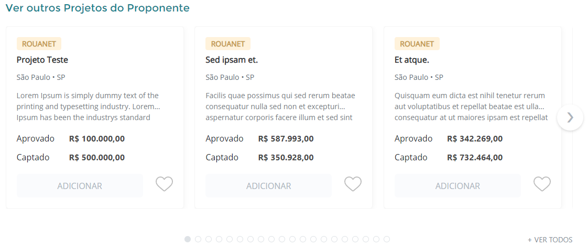
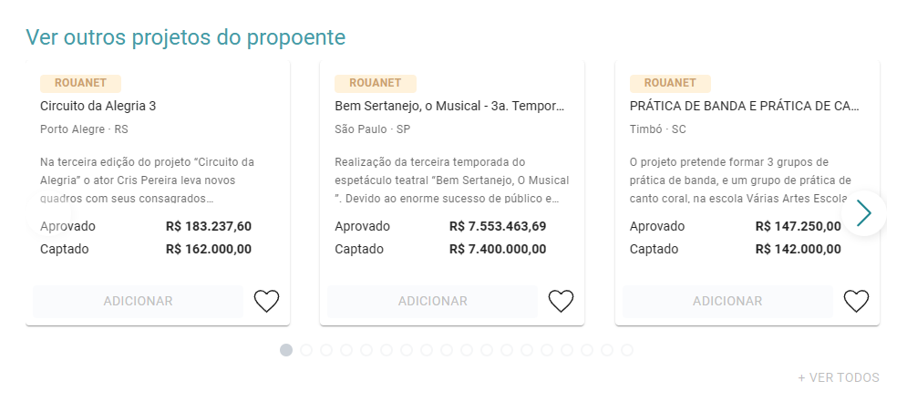

# Simbi Tech Case

<p style="text-align: center;">
    
</p>

## Sumário

- [O Desafio](#the-challenge)
- [Rodando o Projeto](#getting-started) < Atenção aqui 😁
- [Estrutura do Projeto](#project-structure)
- [O Resultado](#the-result)
- [Frontend](#frontend)
- [Backend](#backend)
- [API Endpoints](#api-endpoints)

<h2 id="the-challenge">O Desafio</h2>

O desafio é construir uma aplicação web simples (front end e back end) que carregue um dump de banco de dados previamente criado e o exiba no frontend.

Além de uma API documentada em Swagger, a aplicação deve ter um frontend que exiba os dados do numa seção com slider de cards:



<h2 id="getting-started">Rodando o Projeto</h2>

Para rodar o projeto, siga os 4 passos abaixo:

1. Clone o repositório:

```bash
    git clone https://github.com/Strovsk/simbchallenge.git
```

2. Acesse a pasta do projeto:

```bash
    cd simbchallenge
```

3. Acesse a pasta do docker

```bash
    cd docker
```

> O projeto foi containerizado com Docker, portanto, é necessário ter alguma engine de containerização ou, caso não tenha, é recomendável instalar o [Docker Desktop](https://www.docker.com/products/docker-desktop/)

4. Em seguida, basta executar o comando abaixo para subir o ambiente (esteja certo de estar na raiz do projeto):

```bash
    docker-compose up -d
```

> Se tudo ocorrer bem, você terá as seguintes aplicações rodando:
>
> - Frontend: http://localhost:5173
> - Backend: http://localhost:7800
> - Banco de dados: http://localhost:3303

<h2 id="project-structure">Estrutura do Projeto</h2>

Para facilitar a navegação e a comodidade, optei pela estrutura mono-repo

```bash
simbchallenge
├── backend     # o backend em Laravel junto com as configurações do banco de dados
├── frontend    # o frontend em React
└── README.md   # este arquivo
```

<h2 id="the-result">O Resultado</h2>

O resultado final do desafio foi uma aplicação web que exibe os dados do dump de banco de dados em uma seção com slider de cards.



<h2 id="frontend">Frontend</h2>

O frontend foi desenvolvido em React com Vite como bundler e Material-UI como biblioteca de componentes. A aplicação foi dividida em componentes para facilitar a manutenção e a escalabilidade.
Devido à simplicidade do desafio, não foi necessário utilizar gerenciadores de estado como Redux ou Context API, nem mesmo uma camada de Pages ou soluções com React Router.

[Abrir o frontend no navegador](http://localhost:5173)

[Ver mais informações sobre o frontend...](./frontend/README.md)

<h2 id="backend">Backend</h2>

O backend foi desenvolvido em Laravel 9.x, utilizando o Eloquent ORM para a manipulação dos dados. A aplicação também foi dividida em camadas para facilitar a manutenção e a escalabilidade, neste caso, a arquitetura foi rápida e prática foi a MSC (Model-Service-Controller).

[Abrir o backend no navegador](http://localhost:7800/api/projects)

[Ver mais informações sobre o backend...](./backend/README.md)

<h2 id="api-endpoints">API Endpoints</h2>

Há somente uma rota disponível na API, que é a rota de listagem de todos os registros da tabela `tb_projeto_rouanet_teste`. A rota é a seguinte:

```bash
# GET /api/projects
curl -X GET http://localhost:7800/api/projects
```

Se nenhum parâmetro for passado, a rota considerará o valor padrão da página como 1 e a quantidade de registros por página como 20.

Há uma documentação feita em Swagger para facilitar a visualização e o entendimento da API. Para acessar a documentação, basta acessar a rota `/api/documentation` do backend.
